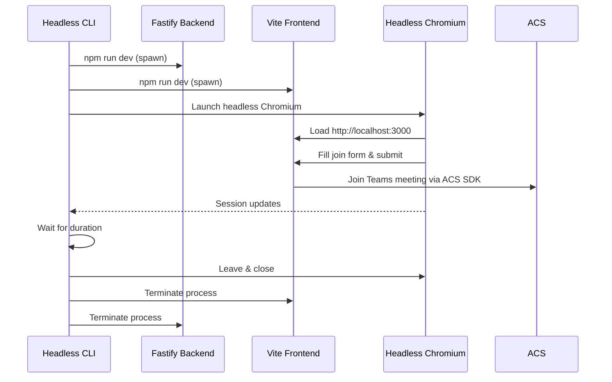

# CLI Implementation Summary

## ✅ Current State

### Headless CLI (`backend/src/cli-headless.ts`)
- Automates the real browser-based join flow via Playwright
- Boots backend (`npm run dev`) and frontend (`npm run dev`) automatically
- Supports both Teams meeting URLs and meeting ID/passcode
- Defaults to a 5-minute stay with `--duration` override
- Provides graceful shutdown and resource cleanup on exit

### Example Bot (`backend/src/example-bot.ts`)
- Demonstrates orchestrating the headless CLI from Node.js
- Handles backend startup, CLI execution, and teardown
- Useful blueprint for CI pipelines or scripted monitoring

### Tooling & Scripts
- Root and backend `package.json` scripts simplified to point exclusively at the headless CLI
- Legacy commands (`cli:simple`, `cli:dev`) removed to prevent confusion
- npm bin entry `acs-meeting-cli` now maps to `dist/cli-headless.js`

### Documentation Refresh
- `README.md`, `CLI_README.md`, and `CLI_STATUS.md` updated to reference only the headless flow
- Obsolete guidance for the deleted CLIs eliminated
- `demo-cli.sh` (updated separately) showcases the new command set

## 🚀 Day-to-Day Usage

```bash
# Join by URL for 5 minutes
npm run cli --workspace=backend -- join-url "https://teams.microsoft.com/l/meetup-join/..."

# Join by meeting ID & passcode for 20 minutes
npm run cli --workspace=backend -- join-id "MEETING_ID" "PASSCODE" --duration 20

# Inspect CLI help
npm run cli --workspace=backend -- --help
```

The CLI streams backend and frontend logs directly, so you can confirm port binding, token issuance, and meeting status from a single terminal session.

## 🏗️ High-Level Flow



## 🔧 Technical Notes

- No browser polyfills required—Playwright gives us the full web stack.
- Backend dependencies trimmed (removed ACS calling SDK, jsdom, ws, etc.).
- Strong signal handling ensures `Ctrl+C` tears everything down cleanly.
- Default Playwright permissions grant microphone access automatically.

## 🗑️ Retired Solutions

| File | Reason Removed |
| --- | --- |
| `backend/src/cli.ts` | Relied on brittle browser polyfills and frequently failed in production scenarios. |
| `backend/src/cli-simple.ts` | Simulated behaviour only; did not actually join meetings. |

Removing these files prevents accidental use of incomplete flows and reduces dependency weight.

## � Key Files

- `backend/src/cli-headless.ts` – Main CLI implementation
- `backend/src/example-bot.ts` – Programmatic wrapper sample
- `CLI_README.md` – Detailed user guide
- `CLI_STATUS.md` – Status overview

## ✅ Validation Snapshot

- TypeScript build: `npm run build --workspace=backend`
- Headless CLI smoke test: invoked with both `join-url` and `join-id` locally
- Documentation updated to remove stale references

The repository now presents a single, fully supported CLI path built on top of the proven browser experience, eliminating maintenance overhead from experimental variants.