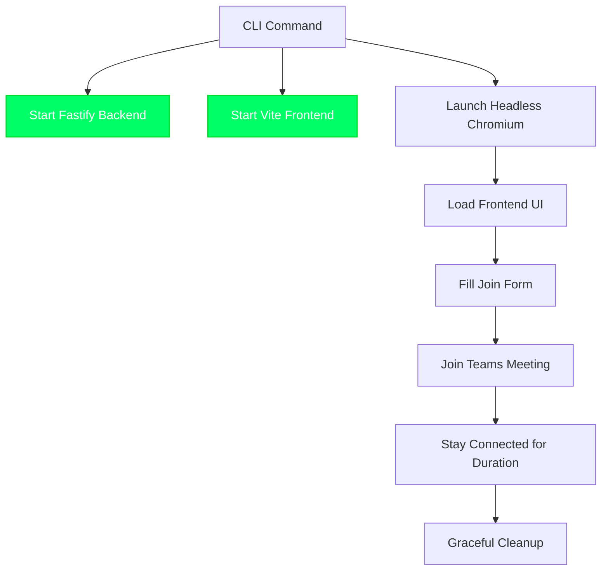

# ACS Meeting CLI (Headless)

A Playwright-powered automation layer that launches the full browser experience in headless mode to join Azure Communication Services (ACS) meetings without manual interaction.

## Prerequisites

1. Configure the ACS connection string in `backend/.env`:
   ```
   ACS_CONNECTION_STRING=endpoint=https://...;accesskey=...
   ```
2. Install project dependencies from the repository root:
   ```bash
   npm install
   ```
3. (One-time) Install Playwright browsers if they are not already cached:
   ```bash
   npx playwright install
   ```

> The CLI handles backend/frontend start-up on its own—no need to launch them manually.

## Quick Start

```bash
# Join via meeting URL for the default 5 minutes
npm run cli --workspace=backend -- join-url "https://teams.microsoft.com/l/meetup-join/..."

# Join via meeting ID + passcode for 15 minutes
npm run cli --workspace=backend -- join-id "MEETING_ID" "PASSCODE" --duration 15
```

### Command Options
- `--duration <minutes>` (alias `-d`): stay in the meeting for the given number of minutes. Default is **5**.

### Exit Early
Press `Ctrl+C` at any time. The CLI traps the signal, leaves the meeting, and tears down all spawned processes before exiting.

## What the CLI Does



1. **Provision Identity** – Uses `CommunicationIdentityClient` to create a user and token.
2. **Boot Servers** – Spawns `npm run dev` inside backend and frontend workspaces, streaming their logs to the terminal.
3. **Automate Browser** – Launches headless Chromium, grants microphone permissions, loads `http://localhost:3000`, and fills the meeting form just like a human.
4. **Monitor Session** – Waits for confirmation, keeps the meeting alive for the requested duration, and surfaces status updates in the console.
5. **Cleanup** – Leaves the meeting, closes the Playwright browser, and terminates backend/frontend processes.

## Troubleshooting & Tips

| Symptom | Fix |
| --- | --- |
| CLI prints “Backend startup timeout” | Check that ports 3000/3001 are free, then retry. |
| Playwright complains about missing browsers | Run `npx playwright install`. |
| Meeting never shows “Connected” | Verify that anonymous join is enabled and the meeting URL/credentials are valid. |
| Want to inspect the UI | Temporarily change `headless: true` to `false` inside `cli-headless.ts` while debugging. |

Logs are prefixed with `[Backend]` or `[Frontend]` so you can see exactly what each service is doing while the headless browser runs.

## Development Notes

- Source file: `backend/src/cli-headless.ts`
- Build output: `backend/dist/cli-headless.js`
- Run without rebuilding when iterating:
  ```bash
  cd backend
  npm run cli:headless -- join-url "https://teams.microsoft.com/l/..."
  ```

### Example Bot Automation

`backend/src/example-bot.ts` demonstrates how to orchestrate the CLI programmatically. It starts the backend, triggers the CLI command with your arguments, and monitors completion.

```bash
# From the repository root
npm run example -- "https://teams.microsoft.com/l/meetup-join/..."
```

## Security Notes

- Tokens are created on-demand and discarded after use.
- The CLI runs entirely on your machine; no meeting data is persisted.
- Always guard the ACS connection string—avoid committing real values to version control.

The legacy Node-only implementations (`cli.ts`, `cli-simple.ts`) have been removed. The headless CLI is the authoritative way to exercise the ACS meeting flow from automation or CI.