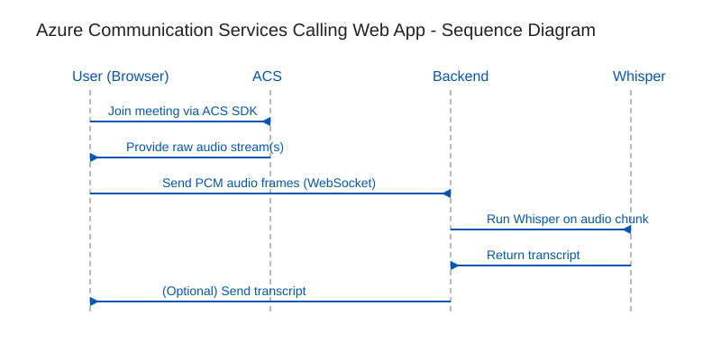

# Azure Communication Services Calling Web App

Fastify meets React for an end-to-end Azure Communication Services (ACS) calling experience with optional headless automation. This repo is a monorepo with separate backend and frontend workspaces plus a Playwright-driven CLI for unattended meeting joins.

## 🧭 Project Overview

| Component | Location | Port | Highlights |
| --- | --- | --- | --- |
| Backend | `backend/` | 3001 | Fastify API, ACS identity token service, WebSocket audio intake, Whisper-ready audio processor |
| Frontend | `frontend/` | 3000 | React + Vite UI, ACS Calling SDK integration, meeting join flows |
| Headless CLI | `backend/src/cli-headless.ts` | n/a | Launches backend & frontend, controls Chromium via Playwright, joins meetings without manual steps |



> The diagram lives in `docs/images/acs-sequence.svg`. Update it if the architecture changes.

## ✅ Prerequisites

- Node.js **18 or newer**
- An ACS resource with a valid connection string
- A Teams meeting that allows anonymous joins
- Playwright browsers installed locally (`npx playwright install` once per machine)

## 🚀 Getting Started

```bash
# Install root and workspace dependencies
npm install
npm install --workspace=backend
npm install --workspace=frontend

# Copy environment template and add your ACS connection string
cp backend/.env.example backend/.env
# edit backend/.env

# Build everything (generates TypeScript output for both workspaces)
npm run build
```

### Environment Variables (`backend/.env`)

```ini
ACS_CONNECTION_STRING=endpoint=https://<resource>.communication.azure.com/;accesskey=<key>
PORT=3001
NODE_ENV=development
```

## 🧑‍💻 Development Workflow

- `npm run dev` — start backend & frontend together (two processes)
- `npm run dev:backend` / `npm run dev:frontend` — run either side individually
- `npm run build` — TypeScript build for both workspaces
- `npm run build:backend` / `npm run build:frontend` — focused builds
- `npm run start` — production backend (`dist/server.js`)
- `npm run test` — run backend and frontend tests (placeholder)

Ports 3000/3001 must be free before starting the dev servers.

## 🤖 Headless CLI Automation

The CLI wraps the full browser flow so automation uses the exact same UI stack users see.

```bash
# Join with meeting URL for the default 5 minutes
npm run cli --workspace=backend -- join-url "https://teams.microsoft.com/l/meetup-join/..."

# Join with meeting ID + passcode for 15 minutes
npm run cli --workspace=backend -- join-id "MEETING_ID" "PASSCODE" --duration 15

# Show CLI help
npm run cli --workspace=backend -- --help
```

What happens under the hood:

1. Spawns the Fastify backend (`npm run dev`) and the Vite frontend (`npm run dev`).
2. Launches headless Chromium, grants microphone permissions, and loads `http://localhost:3000`.
3. Fills the meeting form (URL or ID/passcode) and clicks **Join Meeting**.
4. Waits for connection feedback, then keeps the session alive for the requested duration.
5. On exit (duration elapsed or `Ctrl+C`), leaves the meeting and shuts down all spawned processes.

### CLI Flags

- `--duration <minutes>` (alias `-d`) — stay connected for the specified minutes (default **5**).
- `--` — everything after `--` is forwarded to the CLI (useful when wrapping commands).

Logs are prefixed with `[Backend]` and `[Frontend]` so you can differentiate service output from CLI status messages.

## 🌐 API Surface

| Method | Path | Description |
| --- | --- | --- |
| `GET` | `/health` | Health check with timestamp |
| `POST` | `/token` | Issue an ACS VoIP access token and user ID |
| `WS` | `/audio` | Accept audio chunks for transcription processing |

## 🔊 Audio Processing Pipeline

1. Frontend (or headless CLI) joins the meeting with the ACS Calling SDK.
2. Client streams audio data over WebSocket to the backend.
3. Backend buffers ~30 seconds of PCM data.
4. Audio is prepared for Whisper (16 kHz mono) and transcribed (placeholder hook).
5. Transcripts can be routed to downstream services (extend `audioProcessor.ts`).

## 🛠️ Troubleshooting

| Symptom | Likely Cause | Fix |
| --- | --- | --- |
| `Backend startup timeout` | Ports 3001 (backend) or 3000 (frontend) already in use | Stop other processes or change ports in config |
| `Playwright browser not found` | Playwright browsers not installed | Run `npx playwright install` |
| `ACS_CONNECTION_STRING environment variable is not set` | `.env` missing or malformed | Copy `.env.example`, paste your connection string |
| CLI exits immediately | Meeting URL/ID invalid or meeting closed | Verify the meeting is active and allows anonymous join |
| Browser pop-up permissions errors in dev UI | Browser blocked mic access | Allow microphone usage for `localhost` |

## 🤝 Contributing

1. Follow the standards in `.github/copilot-instructions.md` (DRY, KISS, accessibility, etc.).
2. Run `npm run build --workspace=backend` before opening a PR to ensure TypeScript output stays green.
3. Include documentation updates in this README if workflows change.

## 📄 License

MIT